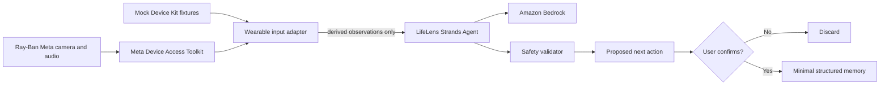

# LifeLens

LifeLens is a privacy-first wearable agent that turns everyday moments into
small, useful next actions across health, work, and relationships. It is built
for the **Agents for Humans Hackathon** with the AWS Strands Agents SDK.

## What the demo shows

- A meal moment becomes a calorie **range** that the user must confirm.
- A conversation becomes an explicit commitment and a neutral reflection,
  without guessing anyone's feelings or personality.
- An evening context becomes a gentle activity proposal based on the user's
  own stated routine.
- No memory or external action is committed without explicit confirmation.

## Architecture



The current hosted demo uses the same consent-gated contract with simulated
moments. The Python service switches between a deterministic demo evaluator and
the real Bedrock-backed Strands agent with one environment flag.

## Run the interactive web demo

Requires Node.js 22.13 or newer.

```bash
npm install
npm run dev
```

## Run the Strands agent API

```bash
cd backend
python -m venv .venv
source .venv/bin/activate
pip install -r requirements.txt
uvicorn lifelens.api:app --reload
```

Demo mode is the default and requires no AWS account. To use Amazon Bedrock,
configure standard AWS credentials, ensure model access in your region, and run:

```bash
export LIFELENS_DEMO_MODE=0
uvicorn lifelens.api:app --reload
```

API surfaces:

- `POST /v1/moments/analyze` — turn a structured wearable moment into a proposal.
- `POST /v1/actions/confirm` — commit the exact proposal only after confirmation.
- `GET /health` — report whether the service is in demo or Bedrock mode.

## Ray-Ban integration boundary

`RayBanMockAdapter` reads JSONL events that match the downstream contract of a
native Meta Device Access Toolkit bridge. The native iOS/Android app should:

1. start capture only after a visible user action;
2. sample the camera/audio stream for the active moment;
3. convert media into the minimal `MomentEvent` observations;
4. discard raw samples; and
5. send only that event to LifeLens.

The included fixtures simulate lunch, a work conversation, and an evening at
home without requiring physical glasses.

## Safety guarantees in the MVP

- observable behavior only; no emotion, personality, honesty, or diagnosis claims;
- calorie and activity outputs remain estimates;
- raw media is rejected by the backend contract;
- all proposed actions require confirmation;
- tests verify that unconfirmed actions cannot mutate memory.

## Tests

```bash
cd backend
pytest
```

## License

MIT
