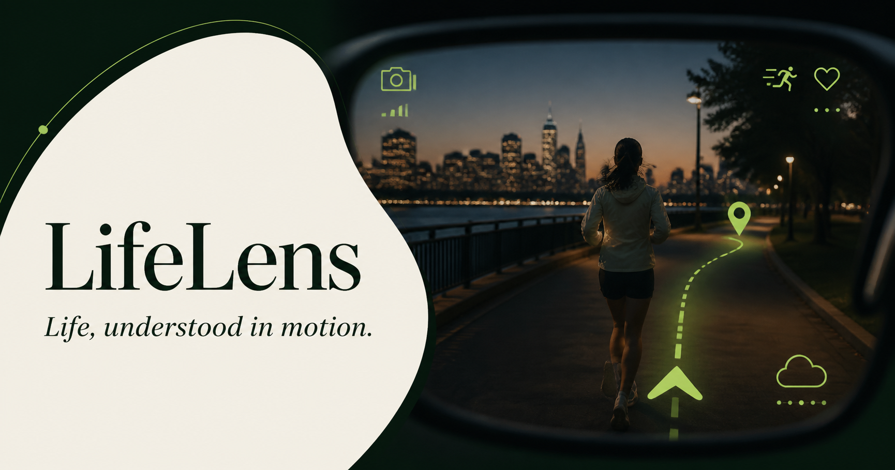
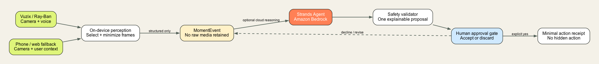
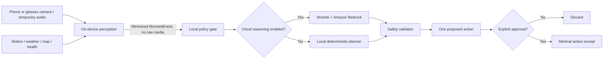

<div align="center">
  

  # LifeLens

  **A consent-first contextual agent for smart glasses.**<br />
  It turns minimized observations from everyday moments into one explainable next action—and waits for the human to approve it.

  [](https://github.com/nightandweather/lifelens-agent/actions/workflows/ci.yml)
  [](https://github.com/nightandweather/lifelens-agent/actions/workflows/vuzix-apk.yml)
  [](LICENSE)
  [](https://strandsagents.com/)

  [**Try the live demo**](https://lifelens-agent.kanghoun.chatgpt.site) ·
  [Judge guide](JUDGES.md) ·
  [Architecture](docs/ARCHITECTURE.md) ·
  [Demo script](docs/DEMO_SCRIPT.md) ·
  [Hardware guide](docs/HARDWARE.md) ·
  [Ray-Ban Meta plan](rayban-meta/README.md) ·
  [App landscape](docs/LANDSCAPE.md) ·
  [Slurm GPU guide](docs/SLURM.md)
</div>

---

## Collaborating

Read [AGENTS.md](AGENTS.md) and [CONTRIBUTING.md](CONTRIBUTING.md) before changes.
Use short-lived task branches and PRs into main; country-specific APIs live in
shared source/configuration, not permanent country branches. See
[regional APIs](docs/REGIONAL_APIS.md) and the
[submission freeze](docs/SUBMISSION_FREEZE.md).

## Wanted Live development

The new [iPhone live experience](https://lifelens-agent.kanghoun.chatgpt.site/live)
adds real camera input, Korean voice questions, and location-based weather.
**Unlike the original local-first design, this prototype sends sampled photos to
Amazon Bedrock only after explicit cloud-photo consent.** It does not yet connect
to physical glasses. KMA and nearby-restaurant lookup depend on configured API
keys; weather fallback is labeled with its actual provider.
See [implementation, privacy boundaries and release gates](docs/WANTED_LIVE.md).

## Why LifeLens

Most wearable assistants either record too much or act with too much confidence.
LifeLens takes a narrower path:

1. the user starts a visible, scoped session;
2. on-device vision/audio turns raw samples into a small structured `MomentEvent`;
3. a Strands agent proposes exactly one action and explains why;
4. a safety validator rejects hidden-state inference and unconfirmed actions;
5. only the exact action approved by the user can create a minimal receipt.

## Four moments, one safety contract

| Moment | Enabled context | Proposal | Never automatic |
| --- | --- | --- | --- |
| Lunch | Vision, authorized InBody record, run profile | Calorie range and optional activity comparison | Meal logging |
| Conversation | Temporary voice, calendar | Remember an explicit promise | Message sending or emotion inference |
| Evening | Activity, routine, calendar | A gentle walk that fits the day | Exercise prescription |
| On the move | Camera, motion, weather, map | A shorter well-lit route home | Rerouting or location sharing |


## What is real today?

| Component | Status | Notes |
| --- | --- | --- |
| Interactive web experience | **Live** | Four operable moments, session pause, approvals, receipts, removable memory |
| Consent and action API | **Live** | Rejects missing confirmation and unsupported actions |
| Python agent service | **Live on AWS** | Real Strands + Amazon Bedrock judge endpoint with deterministic local fallback |
| Safety validator | **Tested** | Raw-media rejection, confirmation, structured-only storage |
| Vuzix M400/M4000 Android client | **Native live integration; hardware validation pending** | Camera2 frame analysis, optional voice questions/TTS, location weather, confirmed local meal records |
| On-device perception boundary | **Implemented contract** | Android adapter interface and shared event schema; model integration pending device profiling |
| Ray-Ban Meta bridge | **Official SDK plan + fixture** | Meta DAT supports iOS/Android camera access and a Mock Device Kit; physical validation pending |
| Live physical-device validation | **Pending hardware** | Evaluation-unit request is open with Vuzix |

The public walkthrough remains deterministic so judges can always complete it.
Its **Analyze with live AI** button calls the deployed Strands + Amazon Bedrock
service; the UI labels any service failure instead of pretending a model
response occurred.

## Architecture





The browser never receives AWS credentials. The web safety proxy sends only the
selected structured moment to the agent service, applies a timeout, and validates
the response again before rendering it. See [the full architecture and threat
boundaries](docs/ARCHITECTURE.md) and [AWS deployment guide](docs/AWS_DEPLOYMENT.md).

The intended mobile path is **local first**: Core ML + Vision on iPhone, or
MediaPipe/LiteRT-compatible models on Android and Vuzix. A small detector can
handle frequent frames; a local VLM can inspect only user-selected keyframes.
Cloud Strands/Bedrock reasoning is optional and receives structured observations,
not the original image. See the [on-device AI plan](docs/ON_DEVICE_AI.md).

## Quick start

### Web

Requires Node.js 22.13 or newer.

```bash
git clone https://github.com/nightandweather/lifelens-agent.git
cd lifelens-agent
npm ci
npm run dev
```

Open the local URL printed by the development server.

### Agent API

Requires Python 3.11 or newer.

```bash
cd backend
python3 -m venv .venv
source .venv/bin/activate
pip install -r requirements.txt
uvicorn lifelens.api:app --reload
```

Demo mode is deterministic and needs no cloud account. Try it with:

```bash
curl -s http://127.0.0.1:8000/health
curl -s -X POST http://127.0.0.1:8000/v1/moments/analyze \
  -H 'Content-Type: application/json' \
  --data-binary @fixtures/meal.json
```

### Real Strands + Bedrock mode

Configure standard AWS credentials with Bedrock model access, then run:

```bash
export LIFELENS_DEMO_MODE=0
uvicorn lifelens.api:app --host 0.0.0.0 --port 8000
```

Point the web server at that service:

```bash
export LIFELENS_AGENT_API_URL=http://127.0.0.1:8000
npm run dev
```

> AWS Builder ID alone does not grant Bedrock runtime access. Use an AWS account
> with IAM credentials and the required Bedrock permissions.

### Docker

```bash
docker build -t lifelens-agent ./backend
docker run --rm -p 8000:8000 lifelens-agent
```

## API

| Method | Path | Purpose |
| --- | --- | --- |
| `GET` | `/health` | Report deterministic or Bedrock mode |
| `POST` | `/v1/moments/analyze` | Convert a minimized moment into one proposal |
| `POST` | `/v1/actions/confirm` | Commit only an explicitly approved proposal |
| `POST` | `/api/analyze` | Web safety proxy to the deployed agent service |

Interactive API documentation is available at `/docs` while the Python service
is running.

## Vuzix prototype

The Android project in [`android-vuzix`](android-vuzix) targets M400/M4000 and
uses standard Android APIs plus the hardware interaction model:

- Camera2 preview and stable-scene sampling; explicit consent sends a reduced JPEG to the live Bedrock endpoint;
- real observation and calorie ranges on the HUD, with change detection and repeated-notice suppression;
- optional Korean speech recognition and TTS when a compatible system service is installed, plus text-question fallback;
- location-consented weather with its actual provider, and explicit confirmation before saving a local meal record;
- pause/stop closes camera and microphone and invalidates pending network callbacks;
- unit tests, Android lint and signed release APK build in GitHub Actions.

This is an integrated native client, **not a physically validated glasses release**.
The current cloud-perception path is separate from the original local-only
`MomentEvent` contract. Read [the hardware guide](docs/HARDWARE.md) for install
steps and remaining device checks, and [the adapter plan](docs/DEVICE_ADAPTERS.md)
for Meta and Samsung scope. The older [store listing draft](VUZIX_STORE.md)
needs reconciliation with the cloud-consent flow before any store submission.

## Ray-Ban Meta integration

Meta now provides an official Wearables Device Access Toolkit for both iOS and
Android. LifeLens will consume an explicitly started camera stream in the phone
companion app, run local perception on selected frames, and emit the same
hardware-neutral `MomentEvent` used by Vuzix. Development can start with Meta's
Mock Device Kit; physical-device latency and audio behavior remain unvalidated.

See the [Ray-Ban Meta integration plan](rayban-meta/README.md). The integration
is a developer-preview prototype and is not presented as a published Meta app.

## Safety properties

- Raw image, video, and audio are not accepted by the agent event contract.
- Every proposal must set `requires_confirmation=true`.
- Conversation analysis cannot claim emotion, honesty, intent, diagnosis, or personality.
- Food and activity numbers remain ranges and are never framed as punishment.
- Location, health, calendar, screen, and communication are separate permissions.
- Confirmed records contain only explicit structured fields.

Run all checks:

```bash
npm test
cd backend && .venv/bin/pytest
```

## Repository map

```text
app/              Interactive web product and server-side safety proxy
backend/          FastAPI + Strands agent, tools, models, validators, tests
template.yaml     Reproducible AWS SAM deployment for the live judge endpoint
android-vuzix/    Native M400/M4000 Android HUD prototype
rayban-meta/      Official Meta DAT integration plan and adapter boundary
docs/             Architecture, hardware, privacy, and Slurm guides
schemas/          Hardware-neutral structured event contract
slurm/            Portable GPU environment smoke test
.github/          CI, APK build, issue forms, and dependency updates
```

## Contributing

Small, safety-preserving contributions are welcome. Read
[`CONTRIBUTING.md`](CONTRIBUTING.md) before opening a pull request. For security
or privacy issues, follow [`SECURITY.md`](SECURITY.md) instead of filing a public
issue.

## Hackathon build provenance

LifeLens was created during the Agents for Humans Hackathon submission period.
The repository's first commit is dated September 1, 2026; its public Git history
documents the build from the initial interactive demo through the Strands,
Bedrock, Vuzix, and Meta integration work. No pre-existing proprietary product
code was incorporated. Standard open-source frameworks, SDKs, starter tooling,
and AI coding assistance were used under their applicable licenses. Hardware
integrations are labeled as implemented, planned, or pending physical validation
rather than being presented as completed work.

## Status and disclaimer

LifeLens is an open hackathon prototype, not a medical device or emergency
navigation system. Calorie, body, exercise, route, and safety information are
estimates and do not replace professional advice or personal judgment.

Built for the **Agents for Humans Hackathon** with AWS Strands Agents and Amazon
Bedrock. Licensed under the [MIT License](LICENSE).
