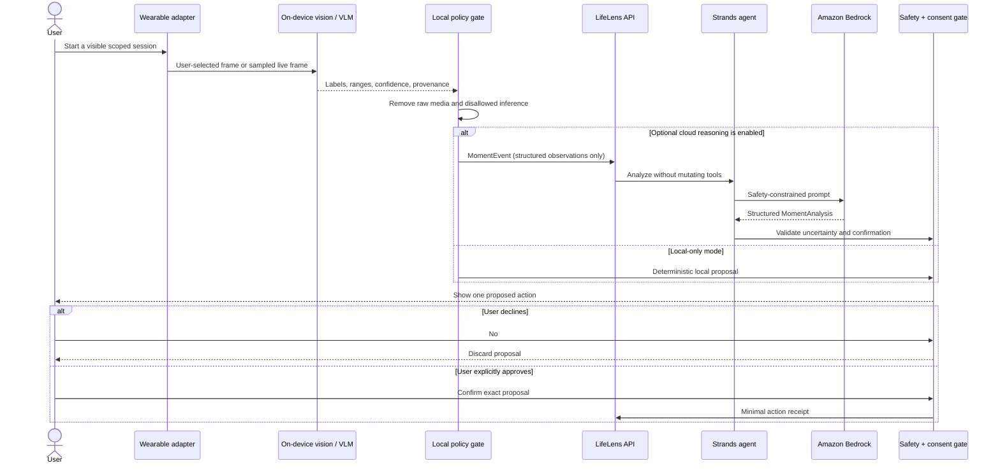

# LifeLens architecture

LifeLens separates sensing, reasoning, and action so that enabling one signal
never silently grants another capability.

## Runtime flow

## Trust boundaries

| Boundary | Accepted | Rejected or excluded |
| --- | --- | --- |
| Wearable → local perception | User-selected or visibly sampled camera/audio data | Background or hidden capture |
| Local perception → policy | Labels, ranges, confidence, model/version provenance | Identity, emotion, intent, diagnosis |
| Policy → agent API | `MomentEvent` observations and optional short excerpt | Raw images, video, or audio blobs |
| Agent → UI | Structured observation, reasoning, uncertainty, one proposal | Silent mutation or multiple hidden actions |
| UI → action tool | Exact proposal plus explicit confirmation | Broad permission or implied consent |
| Action tool → memory | Minimal typed fields | Transcript, raw media, unrelated context |

## Components

### Web product

The Next/vinext application provides the public interactive day. `/api/analyze`
is a server-side proxy: it forwards a minimized fixture to the configured agent
service, times out slow requests, rejects prohibited language, and ensures the
model still requires confirmation.

### Agent service

The FastAPI service exposes analysis, confirmation, and health endpoints.
`LIFELENS_DEMO_MODE=1` uses deterministic results for evaluation and CI.
`LIFELENS_DEMO_MODE=0` initializes a Strands `Agent`, which uses Amazon Bedrock
through the standard AWS credential chain.

### Wearable adapters

The Vuzix client is a native Android implementation. The Ray-Ban adapter is a
contract boundary and JSONL fixture pending physical-device access. Both target
the same `MomentEvent` schema so reasoning and safety are hardware-independent.

### On-device perception

The Android adapter contract lives beside the Vuzix application and accepts a
single frame at a time. A production engine can use a MediaPipe/LiteRT model;
the application remains buildable without bundling a large model. On iPhone,
the equivalent adapter can use Vision and Core ML and emit the same event schema.
Frequent frame filtering and keyframe selection happen locally. No model output
is treated as fact without confidence, provenance, and user correction controls.

See [`ON_DEVICE_AI.md`](ON_DEVICE_AI.md) for the implementation plan and current
truth table.

## Failure behavior

- Missing model service: the UI labels the agent offline and preserves the
  deterministic walkthrough.
- Slow model service: the proxy stops waiting after 20 seconds.
- Unsafe model output: the proxy returns an error instead of rendering it.
- Missing confirmation: the action endpoint returns a conflict and stores nothing.
- Unknown action type: the action endpoint rejects the request.

## Production work remaining

- authenticated per-user sessions and durable encrypted storage;
- deployment of the Strands service within an AWS account;
- signed device-to-service requests and replay protection;
- real device latency, thermal, battery, and accessibility validation;
- third-party review of privacy claims and safety evaluation coverage.
