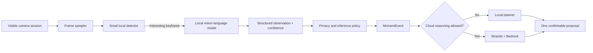

# On-device AI plan

LifeLens is designed so a phone or smart-glasses device can understand a
user-selected image without uploading the original pixels. The local model is
the perception layer; the agent is the planning layer.

## Target pipeline

Use a small detector continuously and invoke the heavier VLM only for a selected
or meaningfully changed keyframe. This is safer for battery, heat, and privacy
than treating every frame as a chat prompt.

## Platform adapters

| Platform | Recommended local path | LifeLens output |
| --- | --- | --- |
| Vuzix / Android | Camera2 + MediaPipe Tasks or a LiteRT-compatible model | `MomentEvent` JSON |
| Ray-Ban Meta + Android | Meta DAT stream + MediaPipe/LiteRT-compatible model | The same `MomentEvent` JSON |
| Ray-Ban Meta + iPhone | Meta DAT stream + Vision + Core ML | The same `MomentEvent` JSON |
| Browser demo | Deterministic, labeled fixtures | The same contract for evaluation |

Android/Vuzix is first because the existing M400/M4000 prototype is a native
Android app. iPhone support should be a separate Swift adapter rather than a
second safety and agent stack.

Meta's Mock Device Kit makes the Ray-Ban companion adapter testable before
hardware arrives, but physical-device latency, thermal behavior, and Bluetooth
audio still require an actual pair.

## Current implementation truth

| Capability | Current state |
| --- | --- |
| Camera preview and explicit session UI | Implemented in the Vuzix prototype |
| Local perception engine interface | Implemented |
| Shared structured event schema | Implemented |
| Bundled image model and real classifications | Not yet implemented |
| Phone/Vuzix thermal and latency measurements | Awaiting physical hardware |
| Automatic calorie measurement from a photo | Not claimed; only an uncertain range after user correction |

The repository deliberately does not download or silently bundle a model. Model
choice depends on target device memory, delegate support, licensing, benchmarked
latency, and the exact foods/objects being evaluated.

## Safety rules

- Raw media stays local by default and is discarded when the visible session ends.
- Cloud mode receives structured labels and ranges, never raw media.
- A food photo cannot establish exact ingredients, mass, or calories; the UI must
  expose uncertainty and allow correction.
- Face input cannot be used to infer emotion, honesty, intent, personality, health,
  or relationship quality.
- Health records, location, microphone, calendar, and camera remain independent
  permissions.
- No proposal is executed without confirmation of that exact proposal.

## Integration checklist

1. Select a redistributable model and document its model card and license.
2. Implement `LocalPerceptionEngine` for Android and benchmark CPU/GPU delegates.
3. Convert the same evaluation set to Core ML and implement the Swift adapter.
4. Test low-confidence rejection, user correction, session deletion, and offline mode.
5. Record p50/p95 latency, peak memory, battery drain, and device temperature.
6. Enable optional cloud reasoning only after the local privacy gate passes.

## Official platform references

- [Apple Core ML](https://developer.apple.com/documentation/CoreML)
- [Apple Vision and Core ML image classification sample](https://developer.apple.com/documentation/CoreML/classifying-images-with-vision-and-core-ml)
- [Google AI Edge image classification for Android](https://developers.google.com/edge/mediapipe/solutions/vision/image_classifier/android)
- [MediaPipe Android setup and delegates](https://developers.google.com/edge/mediapipe/solutions/setup_android)
