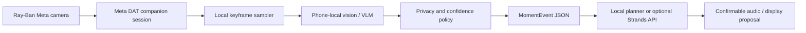

# Ray-Ban Meta integration

LifeLens targets Meta's official Wearables Device Access Toolkit (DAT), not an
unofficial reverse-engineered Ray-Ban API.

## What the official toolkit enables

- Ray-Ban Meta Gen 1 and Gen 2 camera streaming and photo capture;
- iOS and Android companion-app SDKs;
- microphone and speakers through iOS/Android Bluetooth audio profiles;
- simulated permissions, device state, and media streaming through Mock Device Kit;
- display output only on Meta Ray-Ban Display hardware.

The toolkit is currently in Developer Preview. Builds can be shared through
release channels for testing, but open publishing is not yet available.

## LifeLens adapter flow

Raw video is not part of the LifeLens API contract. The adapter should copy only
a bounded frame needed for local inference, release it promptly, and forward
labels, ranges, confidence, capture time, and model provenance.

## Build order

1. Register a project in the Meta Wearables Developer Center.
2. Build Meta's sample against Mock Device Kit on iOS or Android.
3. Map sample video frames into the LifeLens local perception interface.
4. Emit and validate [`../schemas/moment-event.schema.json`](../schemas/moment-event.schema.json).
5. Exercise session start/stop, permissions, disconnects, and raw-frame disposal.
6. Test on physical Ray-Ban Meta hardware before claiming real-time performance.

[`android/LifeLensFrameSampler.kt`](android/LifeLensFrameSampler.kt) is the
first drop-in companion boundary. Feed it a decoded keyframe from DAT's
`videoStream`; it rate-limits local inference, drops frames while busy, rejects
low-confidence results, emits only structured observations, and recycles the
bitmap. The Meta session, HEVC decoder, and chosen local model remain explicit
integration dependencies rather than mocked as complete.

## SDKs and documentation

- [Meta Wearables documentation](https://developers.meta.com/wearables/)
- [Android Device Access Toolkit](https://github.com/facebook/meta-wearables-dat-android)
- [iOS Device Access Toolkit](https://github.com/facebook/meta-wearables-dat-ios)
- [Meta Wearables FAQ](https://developers.meta.com/wearables/faq/)

The Android SDK currently uses `mwdat-core`, `mwdat-camera`, and
`mwdat-mockdevice` artifacts. The iOS SDK is distributed through Swift Package
Manager. Follow the upstream version and licensing instructions rather than
pinning copied SDK binaries in this repository.

## Status

This directory documents an integration-ready boundary. No physical Ray-Ban
device result is claimed yet. A hardware or developer-program request should
link the [live LifeLens demo](https://lifelens-agent.kanghoun.chatgpt.site) and
the [public repository](https://github.com/nightandweather/lifelens-agent).
